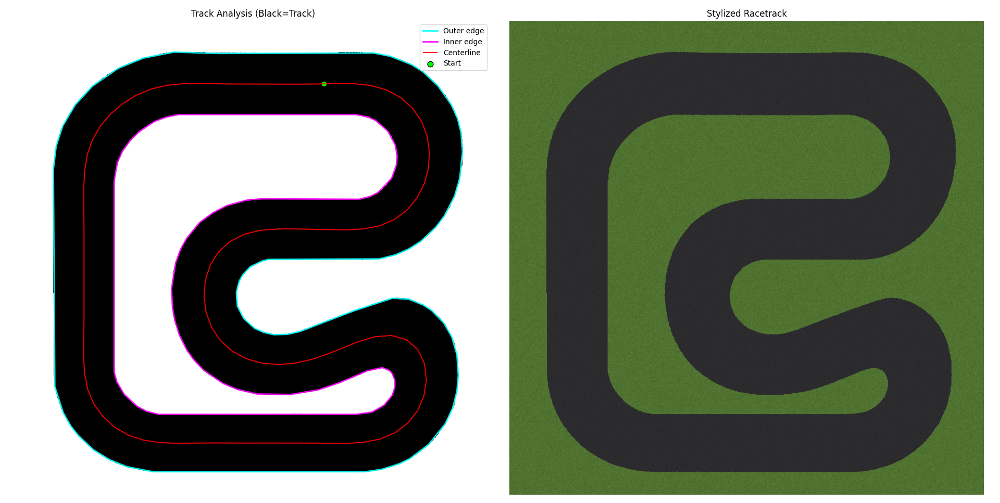
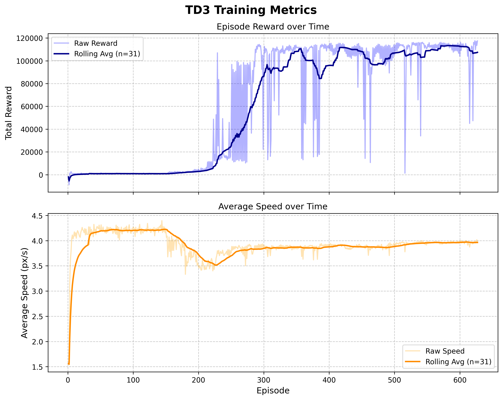
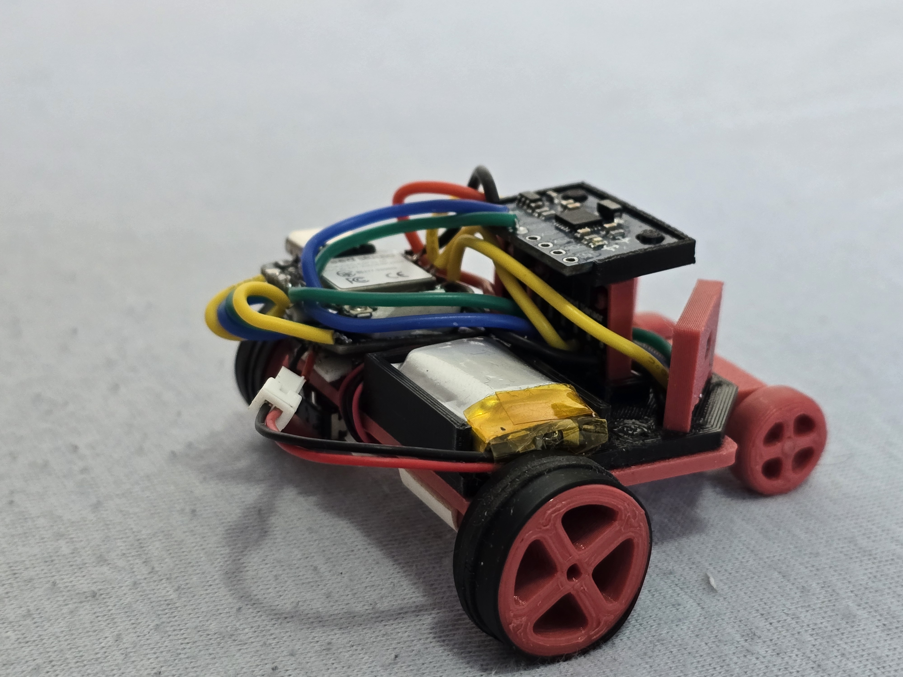
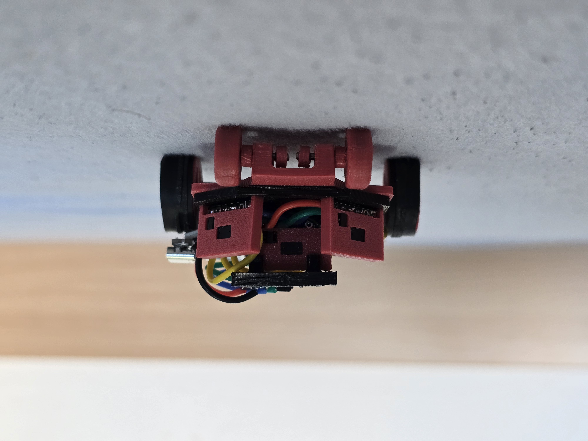

# 🏎️ rc-drive-sim: Sim-to-Real RL RC Car

[](https://www.python.org/downloads/release/python-3120/)
[](https://pytorch.org/)
[](https://opensource.org/licenses/MIT)

> 🔗 **Sister Repository:** This repository is the simulation counterpart to **[rc-drive-robot](https://github.com/Lionile/rc-drive-robot)**, the physical ESP32-based hardware deployment.

`rc-drive-sim` is a custom 2D differential drive simulator designed for Reinforcement Learning (RL). The goal is to train an autonomous RC car using deep reinforcement learning in this simulated environment, and then deploy the trained weights directly to a physical microcontroller.

<p align="center">
  
  &nbsp;&nbsp;&nbsp;&nbsp;
  
</p>

## ✨ Key Features
* **Custom Physics Engine:** 2D differential drive kinematics tailored to approximate the physical motor response of the real-world RC counterpart.
* **RL Algorithm:** Twin Delayed Deep Deterministic Policy Gradient (TD3) optimized for efficient inference on resource-constrained microcontrollers.
* **Headless execution:** Train models efficiently at thousands of steps per second without rendering overhead.
* **C++ Header Export:** Direct weight extraction into native C++ arrays for seamless ESP32 hardware deployment (`tools/export_actor_to_cpp.py`).

---

## 🌎 The Simulation Environment

The simulation approximates the real world by transforming raw track PNGs into physical boundaries, centerline guides, and continuous distance-field heatmaps.

<p align="center">
  
</p>

### State Space (Observations)
The environment provides the agent with an observation space representing a simulated Lidar array:
* **Distance Sensors:** Readings from 3 virtual sensors (Center, +45°, -45°).
* **Augmented History:** To infer momentum correctly, the state space can optionally be augmented with a history of past wheel velocities or past sensor states.

### Action Space
Continuous control of left and right wheel velocities: a in [-1, 1] (or [0, 1] when operating under forward-only constraints).

### Reward Function
The dense reward function encourages forward progress and penalizes erratic behavior:
* **Positive:** Signed forward progress along the track centerline.
* **Negative Components:**
  * Heavy collision penalties (-500)
  * Proximity-to-wall penalties
  * Excessive heading oscillation (wobble) penalizations
  * Wrong-direction episode termination

### Model Training Progression
Before training, the agent acts randomly and immediately fails. After successful TD3 training, the policy navigates complex track curves with continuous, smooth control.

<p align="center">
  
  &nbsp;&nbsp;&nbsp;&nbsp;
  
</p>

---

## 🧠 Model Architecture & Training

The architecture uses a lightweight MLP designed strictly for execution on edge hardware. 

* **Actor:** `[Input] -> 128 -> 128 -> [Output]`
* **Critic:** `[Input] -> 512 -> 512 -> [Output]`

As the agent explores the environment, it utilizes aggregated experience replay buffers across multiple map layouts simultaneously to improve generalization and prevent overfitting to a single track. 

<p align="center">
  
</p>

### Sim-to-Real Pipeline
Once trained, the `best_model.pt` Actor weights are extracted and formatted into a structured C++ header using `tools/export_actor_to_cpp.py`, bypassing the need for heavy inference libraries like TensorFlow Lite or ONNX on the ESP32.

---

## 📸 Physical Hardware Showcase

The final goal of this project is deploying the trained policy to the physical RC car. The physical vehicle uses differential steering to traverse the physical course identically to its simulated counterpart.

<p align="center">
  
  &nbsp;&nbsp;&nbsp;&nbsp;
  
</p>

---

## 🚀 Installation & Execution

### 1. Environment Setup
Clone the repository and install the generated dependencies in your preferred Python virtual environment:
```bash
git clone [https://github.com/Lionile/rc-drive-sim.git](https://github.com/Lionile/rc-drive-sim.git)
cd rc-drive-sim
pip install -r requirements.txt
```

### 2. Training a New Model
Start training a model from scratch based on the configurations listed in `configs/td3.yaml`. Use the `--render` flag if you want to watch the initial epochs, or leave it off for headless performance.
```bash
python train.py --config configs/td3.yaml --episodes 1000
```

### 3. Evaluating an Existing Checkpoint
Watch the trained policy drive via the PyGame renderer:
```bash
python evaluate.py --controller td3 --model checkpoints/td3/20251112_171034/best_model.pt --fps 50
```
> **Tip:** You can generate your own `.gif` validation recordings by appending the `--record` and `--record-frames N` flags to the command above!

### 4. Visualizing Tools & Plotting
Produce training metric charts and visualize the map generation pipeline:
```bash
python tools/plot_metrics.py --csv checkpoints/td3/20251112_171034/metrics.csv
python tools/visualize_map_pipeline.py --map assets/maps/map_start5.png
```